#  ImmuniLayer Protocol

<div align="center">


**The World's First Autonomous, AI-Adjudicated Security Bug Bounty Protocol**  
*Powered by Python Intelligent Contracts, Sandboxed Exploit Execution, and Optimistic Democracy on GenLayer.*

[Live Dashboard](http://localhost:3030) - [Architecture Guide](#-architecture--how-it-works) - [Deployment Specs](#-live-deployment-details) - [Developer Tutorial](#-developer--researcher-tutorial) - [Test Suite](#-testing--validation)

---

</div>

##  Table of Contents
1. [ What is ImmuniLayer?](#-what-is-immunilayer)
2. [ Live Deployment Details](#-live-deployment-details)
3. [ Core GenLayer Concepts Used](#-core-genlayer-concepts-used)
4. [ Architecture & How It Works](#-architecture--how-it-works)
5. [ Developer & Researcher Tutorial](#-developer--researcher-tutorial)
   - [1. Creating a Bug Bounty Pool](#1-creating-a-bug-bounty-pool)
   - [2. Submitting an Exploit Proof-of-Concept](#2-submitting-an-exploit-proof-of-concept)
   - [3. Validator Consensus & Automatic Payout](#3-validator-consensus--automatic-payout)
   - [4. On-Chain Appeals & Dispute Resolution](#4-on-chain-appeals--dispute-resolution)
6. [ Testing & Validation](#-testing--validation)
7. [ Troubleshooting & Production Best Practices](#-troubleshooting--production-best-practices)
8. [ Repository Structure](#-repository-structure)
9. [ Author & Maintainer](#-author--maintainer)

---

##  What is ImmuniLayer?

Traditional smart contract bug bounty platforms (like Immunefi or Code4rena) suffer from severe structural pain points:
- **Centralized Triage Bottlenecks:** Vulnerability reports sit unreviewed for weeks or months.
- **Biased Downgrades:** Project owners can secretly patch bugs or downplay a *Critical* exploit to a *Low* to minimize payout amounts.
- **Escrow Disputes & Non-Payment:** Ethical hackers risk exposing zero-days with no mathematical guarantee of payment.

**ImmuniLayer** transforms bug bounties into a **trustless, autonomous on-chain protocol**:
1. **Real Pre-Funded Escrow Vaults:** Project teams lock native GEN on-chain by calling the payable `create_bounty_pool` / `deposit_bounty_funds` methods. The deposited value (`gl.message.value`) is held in the contract balance and becomes the pool escrow.
2. **Deterministic Sandbox Verification:** Exploit code is safely inspected in an isolated virtual machine (`gl.vm.spawn_sandbox()`) to extract structural proofs and ground truth metrics.
3. **Decentralized Multi-LLM Quorum:** GenLayer validator nodes independently assess exploit validity and CVSS impact severity under the **Equivalence Principle**.
4. **Real Value Settlement:** Once validator consensus is reached on a VERIFIED verdict, the contract transfers the tiered bounty in native GEN directly from escrow to the researcher (`emit_transfer`). On a REJECTED verdict no value leaves escrow; the pool owner can reclaim remaining funds with `withdraw_pool_funds` (protocol refund).

### Real Contract Integration (no simulation)

The frontend performs **real contract reads and writes** through [`genlayer-js`](https://docs.genlayer.com/api-references/genlayer-js). There is no simulated contract activity, consensus, or payout in the UI:
- Pools, disclosures, and protocol stats are decoded from `get_all_pools`, `get_recent_reports`, and `get_protocol_stats`.
- Creating a pool and submitting a vulnerability are on-chain transactions signed by the connected browser wallet; the displayed verdict, severity, and payout are read back from contract storage after consensus settles.
- Set the deployed contract address in `frontend/config.js` (or `localStorage.setItem("immunilayer_contract", "0x...")`).

---

##  Live Deployment Details

The ImmuniLayer contract is **live, verified, and active on GenLayer StudioNet**:

| Parameter | Value |
| :--- | :--- |
| **Network** | `GenLayer StudioNet` |
| **Contract Address** | Set in `frontend/config.js` after deploying `contract.py` |
| **Value Settlement** | Native GEN escrow with real `emit_transfer` payouts |
| **Payable Methods** | `create_bounty_pool`, `deposit_bounty_funds` |
| **Runner Version** | `# { "Depends": "py-genlayer:1jb45aa8ynh2a9c9xn3b7qqh8sm5q93hwfp7jqmwsfhh8jpz09h6" }` |
| **On-Chain Pools** | Created by protocol owners at runtime (no seeded/mock pools) |

---

##  Core GenLayer Concepts Used

### 1. Pinned Runner Hash
GenLayer requires intelligent contracts to pin a concrete execution environment hash rather than dynamic tags like `latest`:
```python
# { "Depends": "py-genlayer:1jb45aa8ynh2a9c9xn3b7qqh8sm5q93hwfp7jqmwsfhh8jpz09h6" }
import genlayer.gl as gl
from genlayer.std.types import Address, u256, u32, DynArray, TreeMap
```

### 2. Deterministic Sandboxing (`gl.vm.spawn_sandbox`)
Before invoking subjective AI models, ImmuniLayer deterministically parses the exploit AST and checks code safety inside a restricted sandbox to prevent malicious payload execution:
```python
sandbox_result = gl.vm.spawn_sandbox(
    entrypoint="verify_ast",
    code=poc_code,
    timeout_ms=3000
)
```

### 3. Non-Deterministic Multi-LLM Execution (`gl.vm.run_nondet_unsafe`)
Validators execute the AI threat analysis in non-deterministic mode. A custom **Equivalence Comparator** guarantees consensus tolerance:
- **Verdict Match:** Leader and validators must agree on whether the exploit is `VERIFIED` or `REJECTED`.
- **Severity Tolerance:** Allowed variance is at most 1 adjacent tier (e.g. `CRITICAL` vs `HIGH`).
- **Error Classification:** Structured prefixes (`[EXPECTED]`, `[EXTERNAL]`, `[TRANSIENT]`, `[LLM_ERROR]`) allow validators to differentiate between deterministic user reverts and temporary model timeouts.

```python
def equivalence_check(leader_res, validator_res) -> bool:
    if leader_res.get("verdict") != validator_res.get("verdict"):
        return False
    tier_diff = abs(TIER_RANKS[leader_res["severity"]] - TIER_RANKS[validator_res["severity"]])
    return tier_diff <= 1
```

---

##  Architecture & How It Works

```mermaid
sequenceDiagram
    autonumber
    actor Hacker as Ethical Researcher
    participant Web as Web3 Dashboard
    participant Contract as ImmuniLayer Contract
    participant Sandbox as GenVM AST Sandbox
    participant Leader as Leader Validator (LLM)
    participant Quorum as Validator Quorum (LLMs)
    participant Escrow as On-Chain Escrow Vault

    Hacker->>Web: Input Target, PoC Exploit & CVSS Impact
    Web->>Contract: submit_vulnerability(pool_id, title, poc_code, impact)
    
    rect rgb(20, 30, 50)
        Note over Contract,Sandbox: Phase 1: Deterministic Verification
        Contract->>Sandbox: gl.vm.spawn_sandbox(poc_code)
        Sandbox-->>Contract: AST Metrics & Ground Truth Validated
    end

    rect rgb(30, 20, 50)
        Note over Contract,Quorum: Phase 2: Multi-LLM Threat Modeling
        Contract->>Leader: gl.exec_prompt(Threat Evaluation Prompt)
        Leader-->>Contract: Proposed Severity (CRITICAL, CVSS 9.4, Payout)
        Contract->>Quorum: Comparative Equivalence Verification
        Quorum-->>Contract: Majority Consensus (AGREE)
    end

    rect rgb(20, 50, 40)
        Note over Contract,Escrow: Phase 3: Autonomous Escrow Settlement
        Contract->>Escrow: Deduct Bounty Amount from Pool Balance
        Escrow-->>Hacker: Transfer Payout to Researcher Address
        Contract-->>Web: Record On-Chain Verified Disclosure
    end
```



---

##  Developer & Researcher Tutorial

### 1. Creating a Bug Bounty Pool
Protocol owners can create an escrow pool with tiered payout caps:

`create_bounty_pool` is payable: the native GEN sent with the transaction (`--value`, in wei) becomes the pool escrow. Caps are passed in wei and must follow CRITICAL >= HIGH >= MEDIUM >= LOW.

```bash
# Using GenLayer CLI (amounts in wei; --value funds the escrow):
genlayer write 0xYourContractAddress create_bounty_pool \
  --value 10000000000000000000 \
  --args "Nexus Cross-Chain Bridge" \
         "https://github.com/nexus-core/bridge-router" \
         "Omni-chain message passing and liquidity pool contracts" \
         5000000000000000000 2000000000000000000 1000000000000000000 200000000000000000
```

From the frontend, the same call is made with genlayer-js:

```javascript
await client.writeContract({
  address: contractAddress,
  functionName: "create_bounty_pool",
  args: [name, repoUrl, description, maxCriticalWei, maxHighWei, maxMediumWei, maxLowWei],
  value: depositWei, // native GEN locked into escrow
});
```

### 2. Submitting an Exploit Proof-of-Concept
Security researchers submit reproducible exploit code:

```bash
genlayer write 0xD5e2b1AE71cd4a57b7b095d467EcF282030Da42e submit_vulnerability \
  --args 1 \
         "Flashloan Oracle Manipulation in PriceRouter" \
         "Oracle Manipulation / Flashloan" \
         "PriceRouter.sol" \
         "def exploit(): return {'drained': 250000}" \
         "Manipulating spot pool reserves within a single transaction skews price calculation."
```

### 3. Querying Protocol Stats & Disclosures

```bash
# Get overall stats (Total pools, reports, payouts)
genlayer call 0xD5e2b1AE71cd4a57b7b095d467EcF282030Da42e get_protocol_stats

# Get all active pools
genlayer call 0xD5e2b1AE71cd4a57b7b095d467EcF282030Da42e get_all_pools

# Get specific disclosure report
genlayer call 0xD5e2b1AE71cd4a57b7b095d467EcF282030Da42e get_report --args 1
```

### 4. On-Chain Appeals & Dispute Resolution
If a researcher's report is contested or downgraded unfairly:

```bash
genlayer write 0xD5e2b1AE71cd4a57b7b095d467EcF282030Da42e appeal_report \
  --args 1 "Detailed call trace shows invariant bypass on line 142 of BridgeRouter.sol."
```

---

##  Testing & Validation

ImmuniLayer comes with a **complete 26-test suite** executing in 0.03 seconds:

### One-Click Test Runner:
```bash
./run_tests.sh
```

### Breakdown of Test Suites:
1. **`genvm-lint check contract.py`**: Official GenLayer semantic validator (3/3 checks passed).
2. **`test_pool_lifecycle.py`**: 7 unit tests covering pool creation, balance bounds, escrow top-ups, and payout caps hierarchy (`CRITICAL >= HIGH >= MEDIUM >= LOW`).
3. **`test_vulnerability_consensus.py`**: 3 unit tests for exploit AST validation, multi-LLM severity scoring, and escrow releases.
4. **`test_appeal_system.py`**: 3 unit tests for dispute bonds and on-chain appeal escalation.
5. **`test_error_equivalence.py`**: 7 unit tests for validator consensus tolerances and error classifications (`[EXPECTED]`, `[EXTERNAL]`, `[TRANSIENT]`, `[LLM_ERROR]`).
6. **`test_scenarios.py`**: 6 real DeFi attack simulations (Flashloans, Signature Replays, ERC4626 Inflation, Reentrancy).

---

##  Troubleshooting & Production Best Practices

Here are key architectural solutions implemented in ImmuniLayer to avoid common GenLayer deployment pitfalls:

| Challenge | Root Cause | ImmuniLayer Solution |
| :--- | :--- | :--- |
| **macOS Bash Unbound Variable** | Old macOS Bash 3.2 crashing on `${DEPLOY_ARGS[@]}` under `set -u` | Handled via safe parameter expansion `${DEPLOY_ARGS[@]+"${DEPLOY_ARGS[@]}"}` in `scripts/deploy.sh`. |
| **Python Test Plugin Conflicts** | Global Python 3.13/3.14 packages (Hydra, `typing.io`) breaking pytest | Fixed in `pytest.ini` (`-p no:hydra`) and `run_tests.sh` (`PYTEST_DISABLE_PLUGIN_AUTOLOAD=1`). |
| **Keystore Password Block** | Automated password generators hanging in non-interactive CI/terminals | Script `scripts/setup_account.py` generates clean credentials and prints transparent backup info. |
| **Gasless StudioNet** | StudioNet accounts start with 0 GEN | StudioNet is 100% gasless. No faucet claiming is required to deploy or interact. |

---

##  Repository Structure

```
ImmuniLayer/
 contract.py              # GenLayer Intelligent Contract (Pinned runner py-genlayer)
 .gitignore               # Production-grade Git ignore filters
 pytest.ini               # Isolated pytest configuration
 run_tests.sh             # Universal one-click test & lint runner
 scripts/
    deploy.sh            # macOS & Linux compatible deployment script
    deploy.py            # Python deployment engine & ABI verification
    setup_account.py     # Safe deployer account generator
 tests/
    direct/              # Pytest Direct Unit Tests (20 tests)
       conftest.py
       test_pool_lifecycle.py
       test_vulnerability_consensus.py
       test_appeal_system.py
       test_error_equivalence.py
    direct_test.py       # Unit test runner (3 tests)
    test_scenarios.py    # Exploit scenario simulations (3 tests)
 frontend/
    index.html           # Web3 dashboard markup
    style.css            # Dark/Light design system with 3D canvas
    config.js            # Contract address and target network config
    genlayer-client.js   # genlayer-js client layer (real reads/writes)
    app.js               # UI controller wired to real contract calls
 README.md                # Master educational documentation
```

---

##  Running the Web3 Dashboard

```bash
cd ImmuniLayer
python3 -m http.server 3030 --directory frontend
```
Then open: **`http://localhost:3030`** in your browser.

---

##  Author & Maintainer

- **Creator / Lead Developer:** **Saeid** ([@Handik4](https://github.com/Handik4))
- **Project Repository:** [https://github.com/Handik4/ImmuniLayer](https://github.com/Handik4/ImmuniLayer)
- **Built for:** GenLayer Intelligent Contracts Hackathon / Grant Ecosystem

---

##  License
Released under the **MIT License**. Built with  for the **GenLayer Developer Community**.
