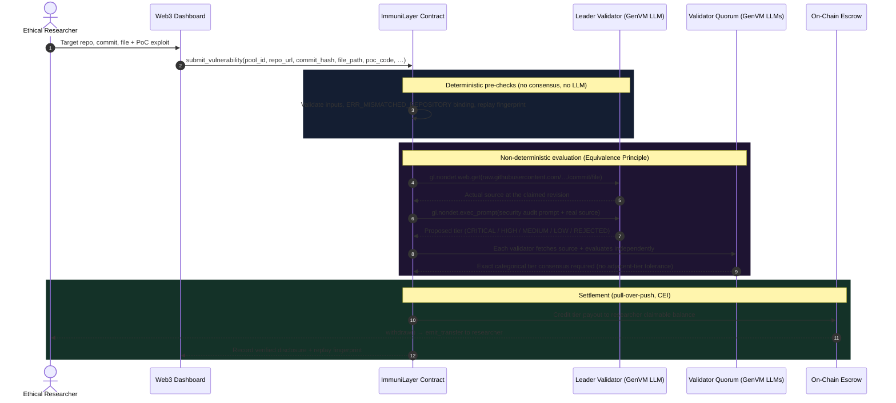

# ImmuniLayer — Autonomous Bug Bounty & Exploit Triage Protocol on GenVM

<div align="center">

-00E5FF?style=for-the-badge&logo=ethereum&logoColor=black)


**A decentralized security bounty protocol where a multi-LLM validator quorum — not a centralized triage team — adjudicates vulnerability disclosures and settles native-GEN payouts autonomously on GenLayer.**

</div>

---

## Table of Contents

1. [What is ImmuniLayer?](#what-is-immunilayer)
2. [Deployment & Network Details](#deployment--network-details)
3. [Architecture](#architecture)
4. [Security Invariants](#security-invariants)
5. [Payout Tier Schema](#payout-tier-schema)
6. [Consensus v0.6 Transaction Handling](#consensus-v06-transaction-handling)
7. [GenLayer v0.3.0 Concepts Used](#genlayer-v030-concepts-used)
8. [Contract API](#contract-api)
9. [Developer & Researcher Tutorial](#developer--researcher-tutorial)
10. [Test Suite](#test-suite)
11. [Repository Structure](#repository-structure)
12. [Running the Dashboard](#running-the-dashboard)
13. [Maintainer & License](#maintainer--license)

---

## What is ImmuniLayer?

Traditional bug-bounty platforms concentrate power in a centralized triage team: reports can sit unreviewed for weeks, a *Critical* finding can be quietly downgraded to a *Low* to shrink a payout, and researchers have no mathematical guarantee they will be paid for a valid disclosure.

**ImmuniLayer** replaces that trusted intermediary with an intelligent contract on GenLayer:

1. **Real pre-funded escrow.** Projects open a bounty pool and lock native GEN on-chain via the payable `create_bounty_pool` / `deposit_bounty_funds` methods. The deposited value becomes the pool's withdrawable/payable escrow.
2. **Ground-truth-grounded evaluation.** Every report binds to an exact target revision (`repo_url` + `commit_hash` + `file_path`). During the non-deterministic phase each validator independently retrieves the raw source at that revision from `raw.githubusercontent.com`, so the assessment is grounded in the real code — not the researcher's claim.
3. **Autonomous multi-LLM consensus.** GenLayer validators run an LLM security assessment natively on GenVM and reach consensus, under the **Equivalence Principle**, on a discrete CVSS categorical tier.
4. **Trustless settlement.** On a verified verdict the tiered bounty is credited to the researcher's claimable balance and withdrawn via a strict pull-over-push (Checks-Effects-Interactions) pattern. On a rejected verdict no value leaves escrow and the pool owner can reclaim it.

All disclosures, verdicts, settlements, and telemetry are permanently recorded on-chain.

---

## Deployment & Network Details

| Parameter | Value |
| :--- | :--- |
| **Contract Address** | `0x7cA196D3583173993b48375b9F4B1a6DfA3dF896` |
| **Explorer** | https://explorer-studio.genlayer.com/address/0x7cA196D3583173993b48375b9F4B1a6DfA3dF896 |
| **Network** | GenLayer StudioNet (`studio-next`) |
| **Chain ID** | `61999` |
| **RPC URL** | `https://studio-next.genlayer.com/api` |
| **Runner** | `py-genlayer:5jycge4q8k23462jtb0b9fyey1s9qz928sz2nbrd9mg4sxqg2qng` (v0.3.0) |
| **Contract Class** | `ImmuniLayerBugBounty` — 13 methods (6 view, 7 write) |

The frontend reads the address from `frontend/config.js` and can be overridden at runtime with `localStorage.setItem("immunilayer_contract", "0x…")`.

---

## Architecture

ImmuniLayer is a **decentralized multi-LLM consensus protocol**. There is **no code runner, no Docker container, and no isolated code execution** anywhere in the design — evaluation is performed by the GenLayer validator quorum, which reaches multi-LLM equivalence consensus by scoring static vulnerability metadata and CVSS vectors against authoritative repository telemetry, running natively on GenVM under the Equivalence Principle.


```mermaid
sequenceDiagram
    autonumber
    actor Researcher as Ethical Researcher
    participant Web as Web3 Dashboard
    participant Contract as ImmuniLayer Contract
    participant Leader as Leader Validator (GenVM LLM)
    participant Quorum as Validator Quorum (GenVM LLMs)
    participant Escrow as On-Chain Escrow

    Researcher->>Web: Target repo, commit, file + PoC exploit
    Web->>Contract: submit_vulnerability(pool_id, repo_url, commit_hash, file_path, poc_code, …)

    rect rgb(20, 30, 50)
        Note over Contract,Leader: Deterministic pre-checks (no consensus, no LLM)
        Contract->>Contract: Validate inputs, ERR_MISMATCHED_REPOSITORY binding, replay fingerprint
    end

    rect rgb(30, 20, 50)
        Note over Contract,Quorum: Non-deterministic evaluation (Equivalence Principle)
        Contract->>Leader: gl.nondet.web.get(raw.githubusercontent.com/…/commit/file)
        Leader-->>Contract: Actual source at the claimed revision
        Contract->>Leader: gl.nondet.exec_prompt(security audit prompt + real source)
        Leader-->>Contract: Proposed tier (CRITICAL / HIGH / MEDIUM / LOW / REJECTED)
        Contract->>Quorum: Each validator fetches source + evaluates independently
        Quorum-->>Contract: Exact categorical tier consensus required (no adjacent-tier tolerance)
    end

    rect rgb(20, 50, 40)
        Note over Contract,Escrow: Settlement (pull-over-push, CEI)
        Contract->>Escrow: Credit tier payout to researcher claimable balance
        Escrow-->>Researcher: withdraw() → emit_transfer to researcher
        Contract-->>Web: Record verified disclosure + replay fingerprint
    end
```

**Equivalence Principle — exact categorical consensus.** The comparator requires validators to agree on both the verdict (`VERIFIED` vs `REJECTED`) and the **exact** payout tier. There is deliberately no adjacent-tier tolerance, because the tier directly determines how much escrow is released:

```python
def validator_comparator(leader_result):
    validator_eval = evaluate_security_report()
    leader_eval = leader_result.calldata
    if leader_eval.get("verdict") != validator_eval.get("verdict"):
        return False
    # Exact tier match required — no adjacent-tier tolerance.
    return leader_eval.get("tier") == validator_eval.get("tier")

ai_assessment = gl.vm.run_nondet(evaluate_security_report, validator_comparator)
```

**Error classification.** Structured prefixes let validators distinguish deterministic user reverts from transient faults so consensus can rotate instead of permanently rejecting a valid report:

| Prefix | Meaning |
| :--- | :--- |
| `[EXPECTED]` | Business-logic violation (deterministic) |
| `[EXTERNAL]` | External endpoint failure (deterministic) |
| `[TRANSIENT]` | Network / 5xx / rate-limit fault (temporary — rotate) |
| `[LLM_ERROR]` | Non-conforming or unparseable LLM output |

---

## Security Invariants

- **Repository-to-pool binding (`ERR_MISMATCHED_REPOSITORY`).** Every report must target the exact repository registered for its bounty pool. This is a **deterministic assertion** evaluated *before* any LLM evaluation, escrow movement, or consensus:

  ```python
  pool_repo = pool.get("repo_url", "").strip().rstrip("/")
  if repo_url.rstrip("/") != pool_repo:
      raise gl.vm.UserError(
          f"{ERROR_EXPECTED} ERR_MISMATCHED_REPOSITORY: "
          f"report targets {repo_url} but pool is registered for {pool_repo}"
      )
  ```

- **Grounding gate.** If the target source cannot be retrieved (404 / empty), or the LLM cannot confirm the vulnerable logic actually exists at that revision (`source_verified = false`), the tier is forced to `REJECTED` regardless of what the model proposed — no payout is authorized on unverifiable claims.
- **Replay / double-claim protection.** A collision-resistant `Keccak256` fingerprint over `repo_url + commit_hash + file_path + normalized-exploit-id` is recorded on settlement, so the same disclosure against the same revision can never be paid twice — even from a different researcher.
- **Pull-over-push settlement (CEI).** Consensus never performs an external transfer. It only credits `claimable_balances`; researchers pull funds via `withdraw()`, which zeroes the balance before the external `emit_transfer` to prevent re-entrancy.
- **Solvency accounting.** `total_deposited`, `locked_escrow`, and per-beneficiary `claimable_balances` maintain the invariant `locked_escrow == sum(claimable_balances)` and `locked_escrow <= total_deposited`, keeping the contract provably solvent.

---

## Payout Tier Schema

Payouts are an **exact percentage of the pool's escrow cap** (`max_critical`), expressed in basis points to keep the calculation deterministic (no floating point). The payout is capped at the pool's remaining balance.

| Tier | Basis Points | Share of Escrow Cap |
| :--- | :--- | :--- |
| `CRITICAL` | 10000 | 100% |
| `HIGH` | 5000 | 50% |
| `MEDIUM` | 2000 | 20% |
| `LOW` | 500 | 5% |
| `REJECTED` | 0 | 0% (no value leaves escrow) |

---

## Consensus v0.6 Transaction Handling

Under GenLayer Consensus v0.6, a transaction reaching `ACCEPTED` or `FINALIZED` status only means the validator quorum agreed on an **outcome** — and that outcome can be a revert. The dashboard therefore never treats status alone as success. A write is considered successful only when **both** hold:

- transaction status ∈ `['ACCEPTED', 'FINALIZED']`, **and**
- leader `execution_result === 'FINISHED_WITH_RETURN'` (preferring the SDK's `client.isSuccessful(txReceipt)` when available).

`frontend/genlayer-client.js` implements this in `isSuccessful()` and gates `waitReceipt()` on it, throwing a descriptive `Transaction reverted on-chain: <reason>` error (extracted from the leader receipt) so the UI surfaces the real revert reason instead of a false success.

---

## GenLayer v0.3.0 Concepts Used

**Pinned v0.3.0 runner and imports.** The contract pins a concrete runner hash and uses the v0.3.0 module layout:

```python
# v0.3.0
# { "Depends": "py-genlayer:5jycge4q8k23462jtb0b9fyey1s9qz928sz2nbrd9mg4sxqg2qng" }

import genlayer as gl
from genlayer.types import *
from genlayer.storage import TreeMap, DynArray

class ImmuniLayerBugBounty(gl.contract.Contract):
    ...
```

**Non-deterministic multi-LLM execution.** `gl.vm.run_nondet(leader_fn, validator_fn)` runs the leader evaluation and the validator comparator; each node independently fetches the target source (`gl.nondet.web.get`) and runs the LLM assessment (`gl.nondet.exec_prompt(prompt, response_format="json")`).

**Real value settlement.** Native GEN is moved with the EVM contract interface (`emit_transfer`) only from `withdraw()` / `withdraw_pool_funds()`, following the pull-over-push model.

---

## Contract API

**Payable writes**
- `create_bounty_pool(name, repo_url, description, max_critical, max_high, max_medium, max_low) -> u32` — opens a pool; the native GEN sent becomes escrow.
- `deposit_bounty_funds(pool_id) -> str` — top up an existing pool's escrow.
- `deposit(pool_id) -> str` — canonical sponsor-funding alias of `deposit_bounty_funds`.

**Writes**
- `submit_vulnerability(pool_id, title, vuln_type, target_component, repo_url, commit_hash, file_path, poc_code, impact_description) -> u32`
- `withdraw() -> str` — beneficiary pulls their credited native GEN (CEI).
- `withdraw_pool_funds(pool_id) -> str` — pool owner reclaims remaining escrow.
- `appeal_report(report_id, appeal_justification) -> bool`

**Views**
- `get_pool(pool_id)`, `get_report(report_id)`, `get_protocol_stats()`, `get_claimable(beneficiary)`, `get_all_pools()`, `get_recent_reports(limit)`

---

## Developer & Researcher Tutorial

All CLI examples target studio-next (`--rpc https://studio-next.genlayer.com/api`). Monetary amounts are in wei (1 GEN = 10¹⁸ wei).

**1. Create a bounty pool** (payable; `--value` funds the escrow; caps must follow CRITICAL ≥ HIGH ≥ MEDIUM ≥ LOW):

```bash
genlayer write 0x7cA196D3583173993b48375b9F4B1a6DfA3dF896 create_bounty_pool \
  --rpc https://studio-next.genlayer.com/api \
  --value 10000000000000000000 \
  --args "Nexus Cross-Chain Bridge" \
         "https://github.com/nexus-core/bridge" \
         "Omni-chain message passing and liquidity pool contracts" \
         5000000000000000000 2000000000000000000 1000000000000000000 200000000000000000
```

**2. Submit a vulnerability** bound to an exact target revision (the `repo_url` must match the pool's registered repository, or the call reverts with `ERR_MISMATCHED_REPOSITORY`):

```bash
genlayer write 0x7cA196D3583173993b48375b9F4B1a6DfA3dF896 submit_vulnerability \
  --rpc https://studio-next.genlayer.com/api \
  --args 1 \
         "Flashloan Oracle Manipulation in PriceRouter" \
         "Oracle Manipulation / Flashloan" \
         "PriceRouter.sol #getPrice()" \
         "https://github.com/nexus-core/bridge" \
         "a1b2c3d4e5f6a7b8c9d0e1f2a3b4c5d6e7f8a9b0" \
         "contracts/PriceRouter.sol" \
         "def exploit(): ... assert drained >= 3_500_000 * 10**18" \
         "Manipulating spot reserves within a single tx skews the price calculation."
```

**3. Query protocol state and disclosures:**

```bash
genlayer call 0x7cA196D3583173993b48375b9F4B1a6DfA3dF896 get_protocol_stats --rpc https://studio-next.genlayer.com/api
genlayer call 0x7cA196D3583173993b48375b9F4B1a6DfA3dF896 get_all_pools     --rpc https://studio-next.genlayer.com/api
genlayer call 0x7cA196D3583173993b48375b9F4B1a6DfA3dF896 get_report --args 1 --rpc https://studio-next.genlayer.com/api
```

**4. Withdraw a settled bounty** (beneficiary pull):

```bash
genlayer write 0x7cA196D3583173993b48375b9F4B1a6DfA3dF896 withdraw --rpc https://studio-next.genlayer.com/api
```

**5. Appeal a contested verdict:**

```bash
genlayer write 0x7cA196D3583173993b48375b9F4B1a6DfA3dF896 appeal_report \
  --rpc https://studio-next.genlayer.com/api \
  --args 1 "Call trace shows the invariant bypass on line 142 of PriceRouter.sol."
```

---

## Test Suite

**67 in-memory unit tests** run against a direct-mode GenVM via `pytest` + `genlayer-test`, alongside the official `genvm-lint` semantic validation and standalone exploit-scenario scripts.

```bash
# Full suite: genvm-lint + direct unit tests + scenario scripts
./run_tests.sh

# Direct unit tests only
pytest tests/direct/ -v
```

Coverage by module:

| Module | Focus |
| :--- | :--- |
| `test_vulnerability_consensus.py` | Submission flow, exact-tier payout settlement, ground-truth source verification, **repository-mismatch rejection (`ERR_MISMATCHED_REPOSITORY`)**, source-not-found (404) rejection, replay / double-claim rejection, submission validation gates, and exact-tier validator consensus. |
| `test_error_equivalence.py` | Validator Equivalence-Principle comparator: exact-tier agreement, verdict-mismatch and contradictory-tier disagreement (forcing consensus rotation rather than a false settlement), and error classification across `[EXPECTED]` / `[EXTERNAL]` / `[TRANSIENT]` / `[LLM_ERROR]`. |
| `test_settlement_solvency.py` | Pull-over-push withdrawal, multi-claim solvency invariants, transient-fault handling (HTTP 429 / 500 → `[TRANSIENT]`), and malformed / non-conforming LLM output handling (→ `[LLM_ERROR]`, no node crash, no payout). |
| `test_pool_lifecycle.py` | Pool creation, escrow deposits and top-ups, owner-only refund withdrawals, and the CRITICAL ≥ HIGH ≥ MEDIUM ≥ LOW caps hierarchy. |
| `test_appeal_system.py` | On-chain appeal filing, re-appeal counting, and appeal-input validation. |

> Note on hardening: the protocol's defense against adversarial submissions is enforced by (a) the deterministic repository-binding and replay assertions, (b) the grounding gate that rejects any report whose targeted logic cannot be verified in the retrieved source, and (c) `[LLM_ERROR]` handling of non-conforming model output. These are exercised by the modules above.

---

## Repository Structure

```
ImmuniLayer/
├─ contract.py                 # GenLayer v0.3.0 intelligent contract (pinned runner)
├─ run_tests.sh                # genvm-lint + pytest + scenario runner
├─ pytest.ini                  # Direct-mode pytest configuration
├─ scripts/
│  ├─ deploy.sh / deploy.py    # Deployment helpers & pre-deploy validation
│  └─ setup_account.py         # Deployer account helper
├─ tests/
│  ├─ direct/                  # Direct-mode unit tests (67 tests)
│  │  ├─ conftest.py
│  │  ├─ test_pool_lifecycle.py
│  │  ├─ test_vulnerability_consensus.py
│  │  ├─ test_error_equivalence.py
│  │  ├─ test_settlement_solvency.py
│  │  └─ test_appeal_system.py
│  ├─ direct_test.py           # Scenario script
│  └─ test_scenarios.py        # Exploit scenario script
└─ frontend/
   ├─ index.html               # Web3 dashboard
   ├─ style.css
   ├─ config.js                # Contract address + network config
   ├─ genlayer-client.js       # genlayer-js client + Consensus v0.6 receipt gating
   ├─ app.js                   # UI controller (real contract reads/writes)
   ├─ build.js                 # Static build → dist/
   └─ dist/                    # Built dashboard bundle
```

---

## Running the Dashboard

```bash
cd frontend
npm run build          # assembles dist/ (0-dependency static build)
npm run serve          # serves on http://localhost:8080
```

The dashboard performs **real** contract reads and writes through `genlayer-js` against the deployed contract on studio-next — pools, disclosures, verdicts, and payouts are decoded from on-chain state, not simulated.

---

## Maintainer & License

- **Creator / Lead Developer:** Saeid ([@Handik4](https://github.com/Handik4))
- **Repository:** https://github.com/Handik4/ImmuniLayer
- **Built for:** the GenLayer Intelligent Contracts ecosystem.

Released under the **MIT License**.
